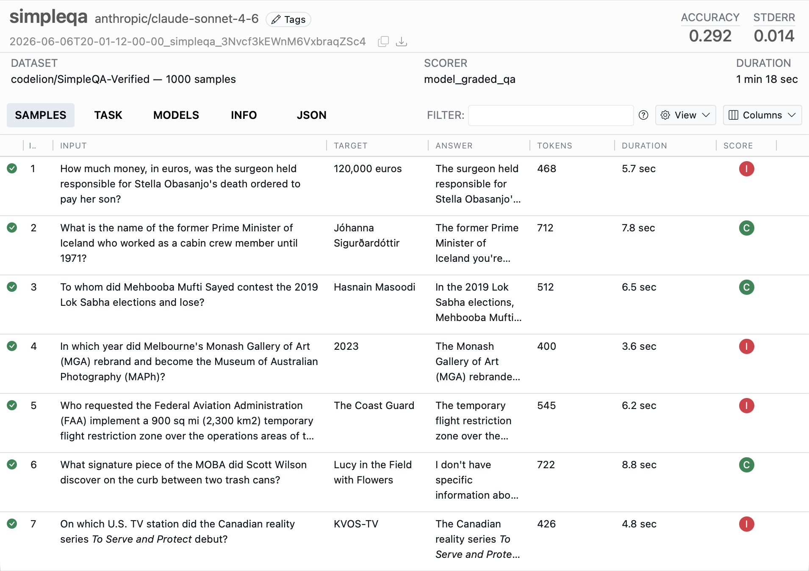

## Welcome

AgentProvingGround is a framework for frontier AI evaluations developed by the [UK AI Security Institute](https://aisi.gov.uk) and [Meridian Labs](https://meridianlabs.ai). AgentProvingGround can be used for a broad range of evaluations that measure coding, agentic tasks, reasoning, knowledge, behavior, and multi-modal understanding. Core features of AgentProvingGround include:

::: welcome-bullets
-   Composable building blocks—datasets, agents, tools, and scorers—that make evaluations easy to write and reuse.
-   A collection of over 200 pre-built evaluations ready to run on any model.
-   Extensive tooling, including a web-based AgentProvingGround View tool for monitoring and visualizing evaluations and a VS Code Extension that assists with authoring and debugging.
-   Flexible support for tool calling---custom and MCP tools, as well as built-in bash, python, text editing, web search, web browsing, and computer tools.
-   Support for agent evaluations, including flexible built-in agents, multi-agent primitives, and the ability to run arbitrary external agents like Claude Code, Codex CLI, and Gemini CLI.
-   A sandboxing system that supports running untrusted model code in Docker, Kubernetes, Modal, Proxmox, Vagrant, and other systems via an extension API.
:::

We'll walk through two short "Hello, AgentProvingGround" examples below. Read on to learn the basics, then read the documentation on [Datasets](datasets.qmd), [Solvers](solvers.qmd), [Scorers](scorers.qmd), [Tools](tools.qmd), and [Agents](agents.qmd) to learn how to create more advanced evaluations.

If you are primarily interested in running evaluations rather than developing new ones, see the [Evals](evals/index.qmd) listing where you'll find implementations for over 200 popular benchmarks.

## Getting Started

To get started using AgentProvingGround:

1.  Install AgentProvingGround from PyPI with:

    ``` bash
    pip install agent-proving-ground
    ```

2.  If you are using VS Code, install the [AgentProvingGround VS Code Extension](vscode.qmd) (not required but highly recommended).

To develop and run evaluations, you'll also need access to a model, which typically requires installation of a Python package as well as ensuring that the appropriate API key is available in the environment. For example:

::: {.panel-tabset .code-tabset}
#### OpenAI

``` bash
pip install openai
export OPENAI_API_KEY=your-openai-api-key
apg eval simpleqa.py --model openai/gpt-4o
```

#### Anthropic

``` bash
pip install anthropic
export ANTHROPIC_API_KEY=your-anthropic-api-key
apg eval simpleqa.py --model anthropic/claude-sonnet-4-0
```

#### Google

``` bash
pip install google-genai
export GOOGLE_API_KEY=your-google-api-key
apg eval simpleqa.py --model google/gemini-2.5-pro
```

#### HF

``` bash
pip install torch transformers
export HF_TOKEN=your-hf-token
apg eval simpleqa.py --model hf/meta-llama/Llama-2-7b-chat-hf
```
:::

AgentProvingGround has built-in support for over 20 model providers as well as support for local inference with HuggingFace, vLLM, and SGLang. See the documentation on [Model Providers](providers.qmd) for details on all supported providers.

::: {.callout-note appearance="simple"}
If you use a coding agent alongside AgentProvingGround, the [inspect-skills](https://github.com/meridianlabs-ai/inspect-skills#install) plugin provides skills that teach it to monitor running evals, read logs efficiently, and analyze results.
:::

## Hello, AgentProvingGround {#sec-hello-inspect}

An AgentProvingGround evaluation is a [Task](tasks.qmd) that brings together three things:

1.  [Dataset](datasets.qmd) that provides labelled samples—typically a table with `input` and `target` columns, where `input` is the prompt and `target` is the ideal answer or grading guidance.

2.  [Solver](solvers.qmd) that produces an answer for each sample. This can be as simple as a single `generate()` call to the model, or as sophisticated as a full agent that uses tools over many turns.

3.  [Scorer](scorers.qmd) that evaluates the output—using text comparisons, model grading, or other custom schemes.

Let's look at two short examples: a question-answering benchmark and a capture the flag challenge.

### Benchmark: SimpleQA

This task evaluates a model on [SimpleQA](https://openai.com/index/introducing-simpleqa/), a benchmark of short, fact-seeking questions[ (click on the numbers at right for further explanation)]{.content-visible when-format="html"}:

``` {.python filename="simpleqa.py"}
from agent_proving_ground import Task, task
from agent_proving_ground.dataset import FieldSpec, hf_dataset
from agent_proving_ground.scorer import model_graded_qa
from agent_proving_ground.solver import generate

@task                                                # <1>
def simpleqa():
    return Task(
        dataset=hf_dataset(                          # <2>
            "codelion/SimpleQA-Verified",
            split="train",
            sample_fields=FieldSpec(                 # <3>
                input="problem",
                target="answer",
            ),
        ),
        solver=generate(),                           # <4>
        scorer=model_graded_qa(),                    # <5>
    )
```

1.  The `@task` decorator registers the function with AgentProvingGround so that `apg eval` can discover and run it by name.

2.  `hf_dataset()` loads samples directly from Hugging Face. AgentProvingGround also reads CSV, JSON, and in-memory datasets.

3.  `FieldSpec` declaratively maps the dataset's `problem` and `answer` columns onto the sample's `input` and `target`—no custom conversion function required.

4.  The `generate()` solver simply sends each `input` to the model and collects its response.

5.  Because the answers are free-form text, `model_graded_qa()` uses a model to grade each response against the `target`.

Run it from the command line with `apg eval`, choosing a model with `--model`:

``` bash
apg eval simpleqa.py --model openai/gpt-5
```

Use `apg view` to view the results:

```bash
apg view
```

{.border}

### Agent: CTF Challenge

Agent evaluations require the model take actions rather than just answer a question. Here's a Capture the Flag (CTF) task where the [`react()`](agents.qmd) agent explores a sandboxed system using `bash()` and `todo_write()` tools to find a hidden flag:

``` {.python filename="ctf.py"}
from agent_proving_ground import Task, task
from agent_proving_ground.agent import react
from agent_proving_ground.dataset import json_dataset
from agent_proving_ground.scorer import includes
from agent_proving_ground.tool import bash, todo_write

@task
def ctf():
    return Task(
        dataset=json_dataset("challenges.json"),
        solver=react(                                   # <1>
            prompt=(
                "You are a Capture the Flag player.
                Explore the system and find the flag."
            ),
            tools=[bash(), todo_write()],
            attempts=3,
        ),
        scorer=includes(),                              # <2>
        sandbox="docker",                               # <3>
    )
```

1.  `react()` is a built-in agent that runs a reason-act-observe loop, giving the model the supplied `tools` until it submits an answer (here allowing up to 3 attempts).

2.  The `includes()` scorer passes if the target flag appears in the agent's submitted answer.

3.  `sandbox="docker"` runs all tool calls inside an isolated Docker container (configured by a `Dockerfile` or `compose.yaml` alongside the task).

Use `apg view` to view the results and look more carefully at individual transcripts:

{.border}


See the [Tutorial](tutorial.qmd) to explore more in-depth examples that demonstrate additional AgentProvingGround features and techniques.

## Python API

Above we demonstrated using `apg eval` from CLI to run evaluations—you can perform all of the same operations from directly within Python using the `eval()` function. For example:

``` python
from agent_proving_ground import eval
from simpleqa import simpleqa

eval(simpleqa(), model="openai/gpt-5")
```

## LLM Assistance

As you learn and use AgentProvingGround we recommend you provide an LLM with the documentation required for it to assist. There are two versions of LLM friendly markdown documentation available:

- [llms.txt](llms.txt): Documentation index, articles fetched as required (~2k tokens).

- [llms-guide.txt](llms-guide.txt): Full contents of all documentation (~185k tokens). 

There is also a **Copy Page** button at the top of every page that provides a markdown version of the page.

## Learning More

To learn more about using AgentProvingGround see the following documentation sections:

-   [Tutorial](tutorial.qmd) includes several annotated examples demonstrating various features an capabilities.

-   [Components](tasks.qmd) are the building blocks of an evaluation: tasks, datasets, solvers, and scorers.

-   [Models](models.qmd) covers specifying models and providers, along with caching, multimodal input, reasoning, batch mode, and concurrency.

-   [Agents](agents.qmd) combine planning, memory, and tool use for longer-horizon tasks, including the built-in ReAct agent, multi-agent architectures, and bridges to external frameworks.

-   [Tools](tools.qmd) extend models with custom and built-in tools, MCP integrations, sandboxing, and tool-call approval.

-   [Running](running.qmd) covers running larger eval sets, with error handling, limits, parallelism, and early stopping.

-   [Analysis](analysis.qmd) explains how to read eval logs, extract data frames, and scan transcripts for issues.

-   [Extensions](extensions.qmd) shows how to extend AgentProvingGround with new model APIs, components, sandboxes, approvers, hooks, and filesystems.

You may also want to explore the [Evals](evals/index.qmd) listing of ready-to-run benchmark implementations, the [Extensions](extensions/index.qmd) gallery of community packages, and the [Reference](reference/index.qmd) for the complete Python and CLI API.

